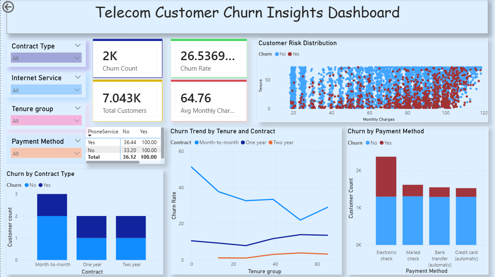

# Telecom Customer Churn Dashboard

## Overview
This Power BI dashboard analyzes telecom customer churn behavior and identifies high-risk customer segments using interactive visualizations.

---

## Tools Used
- Power BI
- DAX
- Power Query
- Excel / CSV Dataset

---

## Dashboard Features
- Churn Rate Analysis
- Customer Risk Distribution
- Contract-Based Churn Trends
- Payment Method Analysis
- Interactive Filters

---

## Key Insights
- Month-to-month customers have the highest churn rate
- Customers with high monthly charges are more likely to churn
- Electronic check users show higher churn behavior
- Long-term contracts reduce churn significantly

---

## Dashboard Preview

---

## Project Objective
The objective of this dashboard is to help telecom companies:
- Identify high-risk customers
- Understand churn patterns
- Improve customer retention strategies
- Support business decision-making
